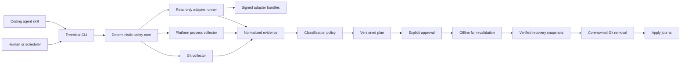

# Treeclear Architecture

Status: Accepted

Date: 2026-09-12

## Explicit-removal amendment — 2026-09-18

The maintainer approved a new default for explicitly selected linked
worktrees: discard all contents, including dirty and ignored files, without
backup. Local branches and retained target/evidence protections remain.
[The explicit-removal contract](../specs/2026-09-18-explicit-worktree-removal.md)
defines selection, optional `--skip-dirty`/backup, confirmation, authenticated
plan migration, and staged acceptance. The maintainer approved proceeding
from its written details on September 18, 2026; this amendment itself
implements no removal command or new option.

That contract takes precedence over the original clean-only, mandatory-backup,
and no-force requirements below only for reviewed explicit whole-worktree
removal. Automatic/scheduled cleanup retains its safe-only restrictions.
The version-1 plan example remains historical read-only behavior. New plans
use the contract's version-2 selection preview, also permanently
non-executable; neither format may be reinterpreted for new deletion.
Recovery sections describe the optional future backup track. Neither this
amendment nor an unrelated review clears source-identity #23, process
visibility #18, or release-signing #25.

## Summary

Treeclear is a cross-platform command-line tool that safely identifies and
removes stale Git worktrees created or used by coding agents.

Its distinguishing feature is a small deterministic safety core combined with
independently updateable, read-only agent adapters. The core correlates Git
state, process activity, agent session activity, and age before it produces a
short-lived cleanup plan. Destructive actions happen only after explicit
approval and full revalidation.

The first release targets macOS and supports evidence from:

- GitHub Copilot
- Claude Code
- Cursor
- Codex
- OpenCode

The product name, repository name, and CLI command are all `treeclear`.

## Release platform scope

macOS is the only supported operating system for the first release. Planned
macOS amd64/arm64 artifacts require native runtime acceptance for each
advertised architecture; a cross-build alone is not that evidence.

Windows support is deferred to
[follow-up #15](https://github.com/hellices/treeclear/issues/15). Preserve the
existing Windows implementations, tests, and platform interfaces. Windows-only
requirements retained in this architecture describe that follow-up, not a
prerequisite for the macOS milestone or a claim of current production support.
Linux remains outside the first release.

The existing native macOS and Windows CI checks remain required; passing
Windows CI is compatibility evidence, not release qualification. This scope
change does not alter repository protections or resolve outstanding review
findings. Shared-code and macOS safety findings remain blocking.

Before cleanup, restore, trash-prune, or scheduler mutation commands are
exposed, unsupported operating systems must refuse them explicitly without
mutation. This is a remaining implementation requirement, not an assertion
that the current read-only preview already enforces a release-platform guard.
Platform deferral changes no safety requirement. The separately approved
explicit-removal amendment changes content-disposal and backup policy, not
the retained evidence, revalidation, privacy, or requested-backup guarantees.

## Product statement

> Clear explicitly selected stale agent worktrees with transparent disposal
> policy, without deleting active or insufficiently understood targets.

Treeclear serves both people and coding agents:

- People can inspect, approve, and apply cleanup plans. Explicit removal
  defaults to no backup; restore is available only with a separately
  implemented, requested, and verified backup capability.
- Agents can call a stable JSON plan/apply protocol through a thin Agent Skill.
- Scheduled jobs can generate reports or apply an explicitly configured
  safe-only policy without running a daemon.

## Context

Coding agents create worktrees faster than developers remove them. Worktrees
often retain dependency directories, build output, coverage data, and other
large files. Over time they consume significant disk space.

Git alone cannot reliably answer whether a worktree is safe to remove:

- `git worktree prune` only removes administrative entries for missing paths.
- A clean worktree may still be in use by an editor, shell, test runner, or
  coding agent.
- An agent session may still refer to the worktree even when no process is
  currently running.
- Agent state is distributed across SDKs, CLIs, session databases, transcript
  files, lock files, and process state.
- The formats and locations of agent state change independently from Git and
  from this tool.

The safe decision therefore requires correlated evidence rather than one
heuristic or one provider-specific integration.

## Goals

### Safety

- Never remove a primary, locked, current, active, or insufficiently understood
  worktree. Ordinary/scheduled cleanup also protects dirty worktrees; an
  explicit discard-all plan may authorize known dirty contents without
  bypassing any retained protection.
- Treat missing, inaccessible, malformed, or unsupported evidence as unknown,
  not inactive.
- Separate planning from mutation.
- Revalidate every target before the first mutation.
- Keep local branches by default.
- Do not create a backup for explicit removal unless requested. Every
  requested backup must be verified before any removal; failure never
  downgrades the plan to unbacked deletion.
- Make apply offline and deterministic.

### Multi-agent support

- Correlate sessions from Copilot, Claude Code, Cursor, Codex, and OpenCode.
- Prefer supported SDK, app-server, or machine-readable CLI interfaces.
- Use private local formats only as version-guarded, read-only fallbacks.
- Report the source and trust grade of every piece of evidence.
- Allow adapter fixes without rebuilding or redistributing the core binary.
- Let users write and test custom adapters.

### Human and agent usability

- Provide readable tables and stable versioned JSON.
- Report why each candidate is safe, review-only, or protected.
- Report expected reclaimable space before approval.
- Provide a portable Agent Skill that calls deterministic CLI commands.
- Support launchd without a resident daemon; Windows Task Scheduler is deferred.

### Distribution

- Ship one native Treeclear executable per operating system and architecture.
- Target macOS in the first release; defer Windows release artifacts to #15.
- Publish checksums and an SBOM.
- Support code signing and notarization in the release pipeline.

## Non-goals

- Replacing Git as a general worktree manager.
- Automatically deleting local branches during ordinary worktree cleanup.
- Automatically deleting agent conversations when a worktree is removed.
- Implementing agent-session archive or deletion in the worktree-cleanup MVP.
  The command namespace is reserved, but lifecycle mutation is delivered only
  after a separate security review.
- Running a background daemon.
- Uploading source code, transcripts, snapshots, or telemetry.
- Executing arbitrary plugin code during unattended cleanup.
- Sandboxing an already trusted third-party agent CLI. Treeclear constrains and
  verifies command-backed evidence sources, but the MVP does not provide an OS
  sandbox for those external executables.
- Treating agent private storage formats as stable public contracts.
- Supporting Windows or Linux in the first release. Preserve the platform
  boundaries for the Windows follow-up and a later Linux implementation.
- Providing a graphical interface in the MVP.

## Competitive position

### Bonsai

[Bonsai](https://github.com/sauravpanda/bonsai) is the closest competitor. It
already provides:

- global worktree discovery;
- `safe`, `review`, and `protected` classifications;
- plan expiry and fingerprint revalidation;
- JSON plan/apply;
- reclaimable-space reporting;
- recovery snapshots and undo;
- an Agent Skill and Claude Code plugin.

Treeclear should match these safety expectations rather than compete as a
lighter wrapper around `git worktree remove`.

Treeclear differentiates itself through:

- first-class evidence from five coding-agent products;
- a provider-neutral capability and evidence model;
- independently updateable signed adapters;
- custom read-only adapters;
- macOS process correlation, with Windows qualification deferred;
- explicit trust grades and fail-closed adapter behavior.

### Worktrunk

[Worktrunk](https://github.com/max-sixty/worktrunk) provides strong worktree
lifecycle management, merge detection, hooks, aliases, and external
subcommands. Its extension model is useful for interactive workflows, but
arbitrary hooks and executables run with the user's permissions. Treeclear
must not use that model inside its unattended safety boundary.

Treeclear should adopt Worktrunk's release discipline, including platform
signing and reproducible release metadata.

### worktree-cleaner and worktree-prune

[worktree-cleaner](https://github.com/DecampsRenan/worktree-cleaner) provides
filesystem-wide orphan discovery and a useful interactive cleanup experience.

[worktree-prune](https://github.com/iltumio/worktree-prune) demonstrates
dry-run-first behavior, plan review, and re-reading state before execution.

Treeclear should borrow those patterns while adding durable plans, recovery,
agent evidence, cross-platform process inspection, and adapter trust controls.

## Terminology

### Worktree

A primary or linked Git working tree returned by
`git worktree list --porcelain -z`.

### Agent session

A persisted or active conversation, thread, task, or run owned by a supported
coding-agent product.

### Evidence

A time-stamped observation from Git, the operating system, an agent-supported
interface, or a guarded private-state reader. Evidence never decides whether
deletion is safe.

### Adapter

A read-only definition that discovers and normalizes agent evidence. The
adapter SPI exposes no method to delete a worktree, file, branch, or agent
session. Command-backed sources remain trusted external executables as
described in the adapter threat model.

### Plan

An immutable, versioned document containing candidates, evidence,
classifications, requested actions, fingerprints, adapter versions, and an
expiry time.

### Apply journal

A durable record of preflight, snapshots, completed actions, skipped actions,
and failures for one plan. Snapshots exist only when requested. The journal
makes interrupted operations observable; resumption requires trustworthy
outcomes and fresh revalidation, never a claim that an absent path alone
proves this plan removed it.

### Recovery snapshot

A local archive containing the minimum state needed to recreate a removed
worktree and its non-ignored changes.

## Safety invariants

The following rules are architectural invariants, not configurable defaults:

1. Only the native core can perform destructive actions.
2. The adapter SPI returns evidence only and exposes no mutation API.
3. Unknown is never equivalent to inactive.
4. Private-state parse failures block affected candidates.
5. Apply never downloads or updates adapters.
6. Apply uses the exact adapter versions and policy digest recorded in the
   plan.
7. All candidates pass preflight before any candidate is removed.
8. All required snapshots are written and verified before any candidate is
   removed.
9. Plan changes, evidence changes, PID reuse, or Git-state changes abort before
   the first removal.
10. Ordinary/scheduled cleanup never uses `git worktree remove --force`.
    Only an authenticated explicit discard-all plan may authorize a single
    force after retained checks pass; never defeat a lock, escalate a failed
    removal, or fall back to recursive filesystem deletion.
11. The primary worktree cannot be removed.
12. A local branch is preserved unless the user creates and approves a
    separate branch-deletion plan.
13. Agent session cleanup is never implied by worktree cleanup.
14. Scheduled cleanup is plan-only unless the user explicitly enables a
    safe-only apply policy.
15. Snapshots and evidence remain local and are never uploaded by Treeclear.
16. A command-backed adapter records and revalidates the resolved executable
    path, version, and digest. Replacing the executable invalidates the plan.

## High-level architecture



## Core components

### Repository discovery

Repository discovery accepts repeatable roots. It:

- canonicalizes each root;
- finds primary Git repositories without traversing ignored dependency and
  cache directories;
- deduplicates repositories by common Git directory identity;
- handles nested repositories explicitly;
- records discovery errors rather than silently skipping them.

Inside a Git repository, the default scope is that repository. Outside a Git
repository, Treeclear uses configured discovery roots. If none exist, it shows
onboarding guidance and performs no global scan. Treeclear must not scan the
entire filesystem by default.

### Git collector

The Git collector is authoritative for worktree identity and state. It uses
Git's machine-readable interfaces:

```text
git worktree list --porcelain -z
git status --porcelain=v2 -z --untracked-files=all
git ls-files --others --exclude-standard -z
git diff --binary --no-ext-diff --no-textconv
git diff --cached --binary --no-ext-diff --no-textconv
```

It records:

- canonical worktree path;
- common Git directory;
- per-worktree administrative directory;
- primary, linked, detached, locked, and prunable state;
- lock reason;
- HEAD object ID;
- branch and upstream;
- staged, unstaged, unmerged, and untracked state;
- remote reachability and base-branch integration;
- index and administrative metadata hashes;
- last commit time;
- worktree metadata modification time;
- estimated reclaimable bytes.

Git commands are executed with argv arrays, a fixed locale, bounded output, and
timeouts. Treeclear never constructs shell command strings.

### Process collector

The process collector produces a point-in-time process snapshot with:

- PID;
- process creation time;
- executable identity;
- current working directory when available;
- access or inspection errors.

macOS uses a native Darwin implementation based on `proc_pidinfo` and process
start information.

The deferred Windows implementation uses process handles, process creation
time, executable identity, and
the best available current-directory inspection. Access denial or protected
processes yield unknown evidence. Treeclear must not infer inactivity from a
failed Windows process query.

PID creation time is mandatory when a PID from an agent lock file is
revalidated. A reused PID invalidates the evidence.

### Evidence correlator

The correlator normalizes platform path rules and associates evidence with a
worktree when:

- the evidence cwd equals the worktree path;
- the evidence cwd is beneath the worktree path;
- an agent provides a versioned worktree binding;
- a session's repository identity and canonical path match the worktree.

The correlator preserves provenance. It does not collapse conflicting
observations. A conflict becomes a blocked reason.

### Adapter applicability

An unavailable adapter does not globally block unrelated worktrees.

An adapter is relevant to a candidate when at least one of the following is
true:

- a supported agent index references the candidate repository or worktree;
- the worktree is inside a documented provider-managed worktree root;
- a versioned provider binding exists in Git metadata;
- a provider marker identifies the worktree;
- an active process for that provider has cwd inside the worktree.

If a provider is not installed and no provider-owned path or marker applies,
its result is `not-applicable`.

If a provider is installed but discovery fails, only candidates for which
provider relevance cannot be excluded become unknown. Other candidates retain
an adapter warning without being globally blocked.

### Policy engine

The policy engine is a pure deterministic function:

```text
Classification = Evaluate(WorktreeState, ProcessEvidence, AgentEvidence, Policy)
```

It has no filesystem, process, network, Git, or clock side effects. Time is
passed as an explicit input so decision-table tests remain deterministic.

### Plan store

The plan store writes:

- canonical versioned JSON;
- a plan ID derived from plan content and randomness;
- generation and expiry timestamps;
- policy and adapter-lock digests;
- candidate fingerprints;
- normalized evidence and blocked reasons;
- requested actions and snapshot requirements.

Plans are short-lived. The default expiry is 15 minutes.

### Snapshot manager

The snapshot manager writes to a user-private Treeclear data directory using:

1. a temporary directory;
2. restrictive permissions or ACLs;
3. a manifest and content hashes;
4. fsync where supported;
5. atomic rename into the recovery store.

No worktree removal starts until every required snapshot in the plan passes
verification.

### Apply engine

The apply engine:

1. loads the exact plan;
2. verifies its schema, signature state, adapter lock, policy digest, and
   expiry;
3. re-runs Git, process, and agent evidence collection offline;
4. recomputes every candidate fingerprint;
5. aborts the entire batch if any pending candidate changed or became unknown;
6. writes and verifies all requested backups, or records explicit no-backup
   mode without creating recovery artifacts;
7. removes approved worktrees serially through `git worktree remove`;
8. writes each state transition to an apply journal;
9. prunes only administrative records explicitly included in the plan;
10. reports removal outcomes and accurately qualified space estimates, plus
    recovery data only when a verified backup was requested.

If a removal fails after earlier removals succeeded, the journal records a
partial result. A repeated apply verifies already completed paths are absent
and revalidates all remaining targets before continuing. Ambiguous journal
outcomes and recreated paths require refusal, not an inferred success or
another deletion. No-backup apply does not promise rollback.

## Classification model

Treeclear uses three user-facing classes.

The descriptions below remain the ordinary/scheduled cleanup and scan
recommendation model. Explicit-removal eligibility separately evaluates all
retained protections before permitting known dirty contents; removing the
first `dirty` reason from a short-circuit decision is not sufficient.

### Protected

A protected worktree cannot be selected by the default cleanup flow.

Protected reasons include:

- primary worktree;
- current Treeclear working directory or ancestor;
- Git-locked worktree;
- staged, unstaged, unmerged, or non-ignored untracked changes;
- an active process with cwd inside the worktree;
- an active agent session associated with the worktree;
- a recent session inside the configured inactivity window;
- unknown or conflicting relevant evidence;
- inaccessible process or agent state where relevance cannot be excluded;
- an expired, incompatible, unsigned, or unhealthy required adapter;
- unsafe path identity, symlink, junction, or repository overlap;
- failed snapshot preflight.

### Review

A review candidate is clean and apparently inactive but requires a human
decision.

Review reasons include:

- unpushed or unmerged local commits;
- detached HEAD;
- no provable remote or base-branch recovery path;
- an evidence source with a private or low-confidence trust grade;
- an orphaned directory not safely managed by `git worktree remove`;
- an adapter or policy boundary condition that does not prove either safety or
  active use.

Review candidates are never selected by unattended safe-only apply.

### Safe

A worktree is safe only when all of the following are true:

- it is a linked, unlocked, registered worktree;
- it is not current;
- it is clean;
- it has no active process;
- it has no active or recent agent session;
- all relevant evidence is known and non-conflicting;
- every applicable adapter can be completely revalidated from local-readonly
  evidence during apply;
- it exceeds the configured inactivity threshold;
- its branch and commit state have a proven recovery path;
- all required adapters are healthy and trusted;
- its snapshot requirements can be satisfied.

## Adapter architecture

### Design principle

Agent products change faster than the safety core. Provider-specific discovery
must therefore be data, not compiled business logic, whenever possible.

The MVP uses signed declarative adapter bundles. A later version may add signed
external RPC adapters for integrations that cannot be expressed declaratively.
WASI components are deferred until the evidence SPI is stable and a stronger
sandbox provides clear value.

### Adapter trust boundary

An adapter definition can:

- probe whether an agent product is installed;
- invoke a declared read-only command through the core runner;
- exchange declared read-only JSON-RPC messages through the core runner;
- read allowed files through typed read-only primitives;
- query allowed SQLite databases in read-only/query-only mode;
- parse recognized PID lock names or records;
- map validated fields to normalized evidence.

The adapter SPI cannot:

- receive Git or filesystem mutation APIs from Treeclear;
- request worktree, branch, file, or session deletion from Treeclear;
- execute a shell string;
- request unrestricted network access;
- emit a final safe-to-delete decision.

### Declarative primitives

The initial runner supports a deliberately small set:

- `exec-json`
- `exec-jsonl`
- `stdio-jsonrpc`
- `native-sdk`
- `file-json`
- `file-jsonl`
- `file-yaml`
- `sqlite-readonly`
- `pid-lock`

Each primitive has:

- explicit argv or path templates;
- allowed root constraints;
- sanitized environment variables;
- resolved executable identity and digest checks for command-backed sources;
- time and output-size limits;
- an expected schema;
- a mapping into the evidence schema;
- typed failure behavior.

There is no generic shell primitive.

`native-sdk` is limited to audited first-party, read-only bridges for official
SDKs that cannot be expressed through the other primitives. The initial use is
GitHub Copilot session discovery. Adding or changing native bridge code
requires a core release; its declarative fallback schemas remain independently
updateable.

Source revalidation modes are explicit:

- `local-readonly`: core-mediated file, SQLite, PID-lock, and process evidence
  that can be re-collected during offline apply;
- `planning-only`: command, stdio JSON-RPC, and native SDK evidence that may be
  collected for planning but is never executed during apply.

The MVP has no cross-platform network sandbox for external executables.
Therefore command, JSON-RPC, and native SDK evidence cannot by itself qualify
a candidate as safe. An applicable adapter must also provide complete
`local-readonly` evidence, or the candidate is review-only.

Command-backed primitives are a distinct trust boundary. The invoked provider
CLI is an external executable with the user's OS permissions, not a sandboxed
adapter. Treeclear only invokes fixed, reviewed, documented read-only commands
from a signed first-party adapter during normal operation. It records the
absolute executable path, version, digest, argv, and environment fingerprint.

Custom adapters using file, SQLite, and PID primitives remain core-mediated and
read-only. Custom `exec-*` or `stdio-jsonrpc` sources require an explicit unsafe
command-adapter developer setting, display a warning before execution, and are
never eligible for unattended scheduled apply.

### Adapter manifest

An adapter bundle includes a canonical manifest, schemas, mappings, fixtures,
checksums, and a detached signature.

Example:

```json
{
  "format": "treeclear-agent-adapter",
  "formatVersion": 1,
  "adapterId": "codex",
  "adapterVersion": "1.2.0",
  "coreCompatibility": {
    "min": 1,
    "max": 1
  },
  "agentCompatibility": {
    "min": "0.50.0"
  },
  "capabilities": [
    "session.list",
    "session.get",
    "session.status",
    "session.cwd",
    "session.worktree_binding"
  ],
  "sources": [
    {
      "id": "app-server",
      "kind": "stdio-jsonrpc",
      "supportGrade": "supported-app-server",
      "revalidationMode": "planning-only",
      "schema": "codex-thread-list-v2"
    }
  ],
  "permissions": {
    "mutating": false,
    "network": false
  }
}
```

The detached signed payload covers:

- canonical manifest bytes;
- every schema and mapping hash;
- adapter ID and version;
- SPI and core compatibility;
- declared capabilities;
- agent compatibility;
- artifact sizes and SHA-256 hashes;
- publisher key identity.

The installed agent executable is not part of the adapter artifact. For every
command-backed source, Treeclear resolves the executable to an absolute path
and records its version and SHA-256 digest in the plan. Apply revalidates that
identity before collecting fresh evidence. A changed executable aborts the
plan rather than silently changing adapter behavior.

### Capability model

Capabilities are independent so partial providers do not need fake methods:

- `session.list`
- `session.get`
- `session.status`
- `session.resume`
- `session.archive`
- `session.delete`
- `session.cwd`
- `session.worktree_binding`
- `session.export`
- `process.reference`
- `private_state.read`
- `json_output`

Evidence discovery adapters do not receive mutation rights even when a
provider supports archive or delete. Session lifecycle operations use a
separate explicit core-owned command path.

### Support grades

Every capability declares one of:

- `supported-api`
- `supported-app-server`
- `supported-cli`
- `experimental-api`
- `versioned-private`
- `unversioned-private`
- `process-only`
- `unavailable`

The plan shows these grades. Policy may require a minimum grade for unattended
apply.

### Normalized evidence

```text
AgentSessionEvidence {
  adapterId
  adapterVersion
  provider
  sessionId
  threadId?
  projectId?
  cwd?
  repoRoot?
  worktreePath?
  status
  createdAt?
  updatedAt?
  processRefs[]
  binding?
  sourceKind
  supportGrade
  confidence
  schemaVersion
  rawFingerprint
  observedAt
  warnings[]
}
```

Status values are:

- `active`
- `idle`
- `completed`
- `archived`
- `inactive`
- `unknown`
- `not-applicable`

Adapters do not produce `safe`, `review`, or `protected`.

## Initial agent adapters

### GitHub Copilot

Priority order:

1. supported SDK/runtime session listing and metadata;
2. runtime-reported in-use state;
3. guarded read-only `workspace.yaml`;
4. guarded read-only `session-store.db`;
5. recognized `inuse.<pid>.lock` evidence;
6. OS process identity and cwd validation.

Private SQLite access uses read-only/query-only mode, a short busy timeout,
required table and column checks, and a known schema fingerprint. Unknown or
newer schemas block affected candidates.

Ordinary worktree cleanup never calls Copilot session deletion.

### Codex

Priority order:

1. supported app-server thread list, read, and status;
2. supported CLI machine-readable interfaces;
3. versioned `codex-thread.json` worktree binding;
4. guarded local session metadata fallback.

Codex is the reference adapter for the full supported capability set.

### OpenCode

Priority order:

1. `opencode session list --format json`;
2. supported session and database-path CLI discovery;
3. experimental HTTP status API only when explicitly enabled;
4. guarded database fallback.

The adapter must not copy OpenCode's force-removal behavior. Git mutation
remains exclusively in the Treeclear core.

### Claude Code

Priority order:

1. supported CLI session and project operations where machine-readable;
2. documented `.claude/worktrees` convention plus authoritative Git state;
3. guarded transcript metadata from documented transcript locations.

Claude transcript line schemas are private and may change. Parse failures or
unsupported versions produce unknown evidence.

### Cursor

Priority order:

1. supported CLI session listing;
2. ACP for supported known-session state;
3. documented Cursor worktree locations and Git state;
4. guarded private state only when a tested schema is known.

The initial Cursor adapter is conservative because no stable general persisted
session deletion interface is assumed.

## Adapter updates and customization

### Embedded baseline

The binary embeds a known-good adapter bundle set. Treeclear can always fall
back to that set offline.

### Signed overrides

Newer signed adapters are stored in a versioned local cache:

```text
adapters/
  copilot/
    versions/
      1.0.0/
      1.1.0/
  active-state.json
```

`treeclear adapters update`:

1. downloads metadata only in an explicit foreground command or opt-in update
   schedule;
2. verifies the publisher, signature, digest, size, SPI, and compatibility;
3. runs bundled probe and fixture checks;
4. installs immutable version directories;
5. constructs one complete active state containing every adapter's current
   and previous version plus the signed index and lock;
6. atomically replaces `active-state.json`.

Cleanup commands never update adapters.

### Health and rollback

If a newly activated adapter fails its health probe:

- it is marked unhealthy;
- Treeclear atomically writes a new active-state generation selecting the
  previous version;
- the failed version remains available for diagnostics;
- affected candidates remain blocked until a healthy trusted adapter is
  active.

Treeclear never searches for and activates an arbitrary older version during
apply.

### Trust model

The MVP embeds an Ed25519 trust root for first-party adapter releases.

MVP trust-root rotation requires a signed Treeclear core release. Delegated or
online root rotation is deferred to a TUF-based registry design.

The long-term registry may adopt:

- Sigstore verification for release provenance;
- TUF metadata for delegation, expiry, freeze protection, and rollback
  protection.

Apply accepts evidence from:

- embedded adapters;
- valid first-party signed adapters;
- an exact user-pinned adapter digest explicitly trusted for interactive
  apply.

Unsigned adapters are never accepted by unattended apply.

### Custom adapters

Treeclear provides:

```text
treeclear adapters init
treeclear adapters validate <path>
treeclear adapters test <path>
treeclear adapters trust <path> --digest <sha256>
```

The authoring kit includes:

- JSON schemas;
- example manifests;
- normalized evidence fixtures;
- a fake filesystem and fake command runner;
- golden test conventions;
- compatibility and migration guidance.

Unsigned custom adapters run only in developer mode and their evidence is
marked untrusted. A user can explicitly pin both the adapter digest and every
external executable digest for local interactive use. Trust records declare
whether they apply to read-only planning or interactive apply. They never
authorize unattended scheduled apply. Trusting an adapter does not grant it a
Treeclear mutation capability, but trusting a command-backed adapter does trust
that external executable to run with the user's OS permissions.

### Future RPC adapters

Some SDK integrations may exceed the declarative runner. A later SPI may
launch signed external adapters over versioned RPC.

Those processes still return evidence only. They are not considered an OS
sandbox and require signing, pinning, explicit permissions, timeouts, output
limits, and crash isolation.

### Future WASI adapters

WASI components remain an option after the evidence SPI stabilizes. They are
appropriate only if capability-based read access and cross-language adapter
authoring justify the runtime and tooling cost.

## Plan format

The JSON plan is stable, canonical, and versioned.

The example below records the historical version-1 preview. New plans use
the [version-2 selection preview](../specs/2026-09-18-explicit-worktree-removal.md#version-2-selection-preview),
which binds literal selection and disposal/backup intent but always records
`execution: "preview-only"`, `action: "none"`, and no required snapshot.
Both versions remain inspectable and are rejected by the apply-load boundary;
neither is silently upgraded. A qualified execution contract remains pending.

Top-level fields include:

```json
{
  "schemaVersion": 1,
  "planId": "plan_...",
  "generatedAt": "2026-09-12T00:00:00Z",
  "expiresAt": "2026-09-12T00:15:00Z",
  "toolVersion": "0.1.0",
  "policyDigest": "sha256:...",
  "adapterLockDigest": "sha256:...",
  "scope": {},
  "candidates": [],
  "summary": {},
  "warnings": []
}
```

Each candidate includes:

- repository and worktree identity;
- HEAD, branch, upstream, index, and administrative hashes;
- classification and reasons;
- Git, process, and agent evidence;
- evidence trust grades;
- resolved command paths, versions, and executable digests used by adapters;
- inactivity and size calculations;
- requested action;
- snapshot requirements;
- preconditions;
- a candidate fingerprint.

Plans omit transcript and prompt contents. Session titles and summaries are
also omitted by default because they can contain sensitive information.

## Recovery design

This is the optional future recovery track, not a prerequisite for the
default unbacked removal feature. The original exclusions below cannot
qualify a complete backup of discard-all contents: the new opt-in backup
contract must cover otherwise-lost ignored state or reject the target.
Until that coverage and restore are reviewed and verified, requested backup
must fail explicitly without an executable deletion plan.

### Snapshot contents

A snapshot contains:

- Treeclear, plan, and snapshot schema versions;
- repository and worktree canonical identities;
- HEAD object ID and branch or detached state;
- a recovery ref when needed to anchor a detached commit;
- per-worktree Git administrative metadata required for diagnosis;
- `git worktree list --porcelain -z`;
- `git status --porcelain=v2 -z`;
- staged binary patch;
- unstaged binary patch;
- unmerged index-stage metadata;
- non-ignored untracked file bytes;
- file modes and symlink targets;
- SHA-256 manifest;
- adapter evidence identity and policy digest.

Ignored files, dependency directories, caches, and build output are not
archived by default.

### Sensitive and large files

Before apply, Treeclear reports:

- the untracked file manifest;
- total snapshot bytes;
- files exceeding configured limits;
- likely sensitive filenames such as private keys and environment files.

Likely sensitive or over-limit content blocks apply until the user changes the
policy or handles the files. Treeclear does not upload snapshots.

### Restore

`treeclear restore <snapshot-id>`:

1. verifies the snapshot manifest;
2. verifies repository identity;
3. refuses to overwrite an existing worktree path;
4. refuses to move an existing branch;
5. recreates the worktree at the recorded commit;
6. reapplies staged and unstaged state;
7. restores non-ignored untracked files;
8. verifies restored bytes and reports any conflict.

The MVP does not automatically purge recovery entries. Explicit trash pruning
is provided so recovery data is not silently lost.

## Agent session lifecycle

Worktree cleanup uses sessions only as evidence.

The worktree-cleanup MVP reports provider lifecycle capabilities but does not
archive or delete agent sessions. The following separately reviewed command
surface is reserved for a post-MVP release:

```text
treeclear session plan
treeclear session apply --plan <plan-id>
```

It has a separate plan schema, confirmation language, provider capability
checks, and audit journal. Only supported provider lifecycle interfaces may be
used. Claude Code and Cursor operations remain unavailable when their
documented interfaces cannot prove the requested semantics.

Session lifecycle commands are never called by `treeclear apply` for a
worktree plan.

## CLI design

### Read-only commands

```text
treeclear
treeclear scan
treeclear plan
treeclear explain <candidate-id>
treeclear adapters list
treeclear adapters doctor
treeclear adapters validate <path>
treeclear adapters test <path>
treeclear schedule status
treeclear trash list
```

Running `treeclear` without arguments is read-only and displays a concise
summary.

The read-only preview records repeatable `plan --worktree <exact-path>`
selection and optional `--skip-dirty`. It explicitly refuses requested
`--backup`, which requires separately qualified recovery. Planning without
targets does not infer selection, and all preview actions remain `none`.
Execution, confirmation, and explicit-removal eligibility remain pending.

### Mutating commands

```text
treeclear apply --plan <plan-id-or-file> [--yes]
treeclear restore <snapshot-id>
treeclear trash prune --older-than <duration>
treeclear adapters update
treeclear adapters rollback <adapter-id>
treeclear adapters trust <path> --digest <sha256>
treeclear schedule install
treeclear schedule remove
```

Each mutating command clearly identifies its mutation scope and supports
machine-readable results.

Apply confirms the exact selected paths and disposal policy. `--yes` replaces
only that confirmation, not any retained check; non-interactive/JSON apply
requires it. Restore/trash commands belong to the optional backup track.

The scheduler invokes one explicit entry point:

```text
treeclear schedule run --mode plan-only|apply-safe
treeclear schedule run --job adapter-update
```

`plan-only` remains read-only. `apply-safe` creates a plan and applies only its
already-safe actions through the normal apply engine. `adapter-update` runs as
a separate job and process.

### Output

- Human output uses tables and concise reason lists.
- `--format json` emits the stable schema.
- JSON mode writes diagnostics to stderr and data to stdout.
- Paths are absolute and normalized for the host platform.
- No ANSI codes appear in redirected output.
- Local audit logs redact transcript text, tokens, and likely secrets.

## Agent Skill

One standard Agent Skill body is shared across Copilot, Codex, Cursor, and
OpenCode. Claude Code receives the same content in its supported skill
location.

Host-specific packages contain only manifests, installation paths, and
permission declarations.

The skill follows this workflow:

1. verify Treeclear is installed;
2. run `treeclear plan --format json`;
3. explain safe, review, protected, adapter, and recovery results;
4. ask the user for approval;
5. apply the exact unmodified plan;
6. report the apply journal result.

The skill must not:

- inspect private session databases itself;
- create its own safety rules;
- call raw Git worktree deletion;
- pass force flags;
- modify adapter bundles;
- treat missing evidence as safe.

## Configuration

Precedence:

1. CLI flags;
2. repository Treeclear configuration;
3. user Treeclear configuration;
4. built-in safe defaults.

Configuration covers:

- discovery roots;
- inactivity thresholds, with a default of 7 days;
- base branches;
- adapter enablement and minimum trust grades;
- plan expiry;
- snapshot limits;
- schedule behavior;
- safe-only automation policy;
- output preferences.

Repository configuration may make policy stricter but cannot disable safety
invariants.

## Scheduling

Treeclear does not run a daemon.

```text
treeclear schedule install
treeclear schedule status
treeclear schedule remove
```

macOS uses a per-user launchd job.

The deferred Windows implementation uses a per-user Task Scheduler task.
The first-release schedule commands reject unsupported operating systems
without installing, changing, or removing jobs.

Default scheduled behavior:

- run weekly;
- run offline;
- generate a plan and report only;
- do not update adapters;
- do not apply cleanup.

Installed jobs call `treeclear schedule run`, preserving the configured roots,
mode, and private report directory. Cleanup and adapter-update jobs have
separate platform identifiers and never share one process invocation.

The 7-day inactivity threshold is necessary but never sufficient. Process,
session, Git, trust, and recovery checks still apply regardless of age.

Users may separately enable safe-only scheduled apply. Scheduled apply accepts
only embedded or first-party signed adapters. Locally pinned custom adapters
remain interactive-only.

Adapter updates use a separate opt-in schedule and can never run in the same
process as cleanup apply.

## Platform and implementation choice

The native core is implemented in Go.

Reasons:

- straightforward macOS and Windows builds;
- good single-binary distribution;
- mature Git, JSON, filesystem, process, and crypto libraries;
- support for pure-Go read-only SQLite access;
- lower contributor barrier than a Rust implementation;
- predictable CLI startup and deployment.

Platform-specific process code remains behind a small interface so it can be
replaced without changing policy behavior.

## Privacy and security

- Treeclear has no telemetry.
- Treeclear does not upload snapshots or session data.
- Plans omit conversation content.
- Apply is offline.
- Adapter commands use argv arrays, never shell strings.
- Adapter reads are constrained to declared and approved roots.
- SQLite access is read-only and query-only.
- Commands have time and output-size limits.
- Paths are canonicalized with platform-aware handling for symlinks,
  junctions, UNC paths, case folding, spaces, newlines, and non-ASCII names.
- Snapshot directories use user-private permissions or ACLs.
- Temporary snapshots become active only after hash verification and atomic
  rename.
- Adapter artifacts are signed, hashed, pinned, and rollback-capable.
- Release artifacts include checksums and an SBOM.

## Error handling

Treeclear uses typed errors with a stable category in JSON output:

- configuration;
- discovery;
- Git;
- process-inspection;
- adapter-unavailable;
- adapter-incompatible;
- adapter-untrusted;
- adapter-schema;
- evidence-conflict;
- plan-expired;
- precondition-changed;
- snapshot;
- removal;
- restore;
- partial-apply.

Errors are never converted into success-shaped empty evidence.

One adapter failure does not hide unrelated scan results. It blocks only
candidates for which relevance cannot be excluded and appears prominently in
the plan summary.

## Concurrency and performance

- Repository, Git read, process, and adapter discovery may run concurrently
  with bounded worker counts.
- Correlation and policy evaluation are deterministic after collection.
- Apply preflight may collect in parallel.
- Snapshot creation is bounded and cancellable.
- Worktree removal is serial to keep Git administrative mutations predictable.
- Adapter update and cleanup apply cannot hold the state lock simultaneously.

## Testing strategy

### Unit tests

- policy decision table;
- evidence conflicts;
- trust-grade thresholds;
- path normalization;
- plan and candidate fingerprints;
- plan expiry;
- adapter compatibility;
- manifest signature and digest checks;
- snapshot manifest construction;
- apply-journal state transitions.

### Golden adapter fixtures

Each supported agent version has:

- installation probe fixtures;
- supported API or CLI output fixtures;
- private fallback fixtures where applicable;
- malformed, truncated, locked, and future-schema fixtures;
- normalized evidence golden output.

### Fuzzing

- adapter manifests;
- JSON, JSONL, YAML, and SQLite mappings;
- path normalization;
- Git porcelain parsers;
- plan and snapshot readers.

### Git integration tests

Temporary real repositories cover:

- primary and linked worktrees;
- clean and dirty state;
- staged, unstaged, unmerged, and untracked files;
- pushed, unpushed, merged, squash-merged, and detached commits;
- locked and prunable entries;
- nested repositories;
- orphaned directories;
- worktree removal and administrative pruning;
- snapshot and byte-for-byte restore.

### Platform tests

Native macOS execution qualifies the first release. Existing native Windows
regression CI remains required, but Windows-only acceptance below belongs to
follow-up #15. Cross-builds do not replace native execution.

Platform coverage includes:

- process cwd detection;
- PID creation-time validation and reuse;
- access-denied process inspection;
- symlink behavior and deferred Windows junction behavior;
- case and separator normalization;
- spaces, newlines, and Unicode; Windows UNC/long-path acceptance is deferred;
- launchd install, status, and remove; Windows Task Scheduler is deferred.

### Race and interruption tests

- worktree changes after plan;
- process starts after plan;
- agent session becomes active after plan;
- adapter version changes after plan;
- adapter command executable changes after plan;
- snapshot failure;
- process interruption before and during removal;
- partial apply and safe resume;
- update activation failure and adapter rollback.

### Security tests

- adapter cannot invoke mutation primitives;
- untrusted command-backed adapters are not executed outside explicit
  developer mode;
- shell metacharacters remain inert argv data;
- path traversal is rejected;
- undeclared filesystem reads are rejected;
- signature, digest, and compatibility failures block use;
- unsigned adapters cannot influence unattended apply;
- snapshot permissions and ACLs are private;
- likely secrets and size limits block apply as configured.

## MVP completion criteria

The MVP is complete when:

1. No protected or unknown fixture is removed.
2. No candidate is removed after its Git, process, agent, policy, or adapter
   precondition changes.
3. Copilot, Claude Code, Cursor, Codex, and OpenCode report capabilities,
   support grades, and evidence or an explicit unavailable reason.
4. Explicitly selected stale, inactive linked worktrees with known state and
   retained branch/HEAD references can be removed with all local contents,
   without backup by default; `--skip-dirty` exclusions are respected.
5. Installed-binary acceptance proves full selected-content deletion,
   unselected/protected-target and branch preservation, and no recovery
   artifacts for no-backup mode. Backup requests either fail without deletion
   or, after separate qualification, create verified restorable backups.
6. launchd plan-only jobs can be installed, inspected, and removed on macOS.
7. A provider fixture change can be handled by an adapter update without
   rebuilding the core.
8. A corrupt or incompatible adapter is blocked and rolled back.
9. A user can create, validate, test, and explicitly pin a custom read-only
   adapter.
10. No adapter path can obtain a core deletion capability.
11. Apply works without network access.
12. macOS release artifacts pass native integration tests and publish
    checksums and an SBOM.

Unsupported-platform mutation refusal is part of these safety criteria.
Windows product acceptance remains tracked in #15, not counted as passed or
required for this macOS milestone.

## Delivery sequence

1. Go project and CLI skeleton.
2. Git inventory and deterministic policy engine.
3. macOS process evidence, retaining existing Windows compatibility coverage.
4. Plan, fingerprint, journal, and apply preflight.
5. Versioned explicit selection and unbacked removal. Optional verified
   backup and restore are separate reviewed slices, not default prerequisites.
6. Declarative adapter runner and normalized evidence SPI.
7. Five first-party adapter bundles and fixture suites.
8. Signed adapter update, pinning, health, and rollback.
9. Custom adapter authoring and validation.
10. Agent Skill and thin host packages.
11. launchd integration.
12. Signed release pipeline, checksums, and SBOM.
13. Windows qualification and release in follow-up #15, after the macOS milestone.

## Deferred decisions

The following are intentionally deferred and do not alter the MVP safety
model:

- Windows qualification and release timing, tracked in #15;
- Linux release timing;
- Sigstore versus TUF for a larger third-party adapter registry;
- external RPC adapter transport;
- WASI component support;
- encrypted recovery snapshots and key management;
- graphical or full-screen terminal interfaces;
- automatic recovery-entry retention policies;
- a public adapter marketplace;
- agent-session archive and deletion implementation.

## Reference links

- Git worktree documentation:
  <https://git-scm.com/docs/git-worktree>
- Git ls-files documentation:
  <https://git-scm.com/docs/git-ls-files>
- Git diff documentation:
  <https://git-scm.com/docs/git-diff>
- Agent Skills specification:
  <https://agentskills.io/specification>
- GitHub Copilot SDK:
  <https://github.com/github/copilot-sdk>
- Claude Code sessions:
  <https://code.claude.com/docs/en/sessions>
- Cursor CLI:
  <https://cursor.com/docs/cli/overview>
- Codex app-server:
  <https://learn.chatgpt.com/docs/app-server>
- OpenCode CLI:
  <https://opencode.ai/docs/cli/>
- Sigstore blob signing:
  <https://docs.sigstore.dev/cosign/signing/signing_with_blobs/>
- The Update Framework:
  <https://theupdateframework.io/docs/metadata/>
- Bonsai:
  <https://github.com/sauravpanda/bonsai>
- Worktrunk:
  <https://github.com/max-sixty/worktrunk>
- worktree-cleaner:
  <https://github.com/DecampsRenan/worktree-cleaner>
- worktree-prune:
  <https://github.com/iltumio/worktree-prune>
